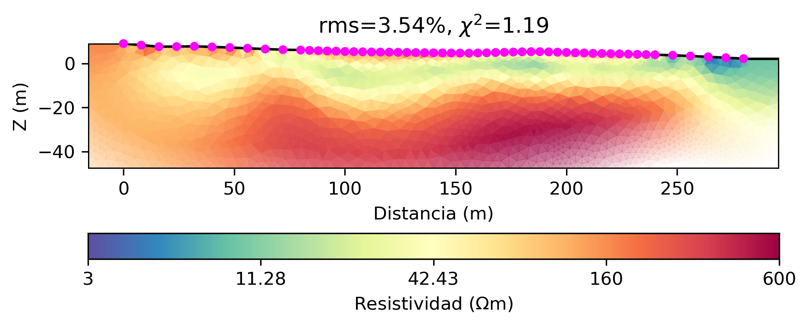
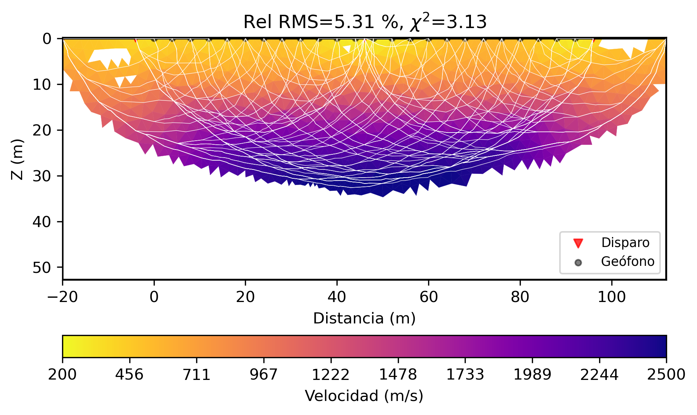
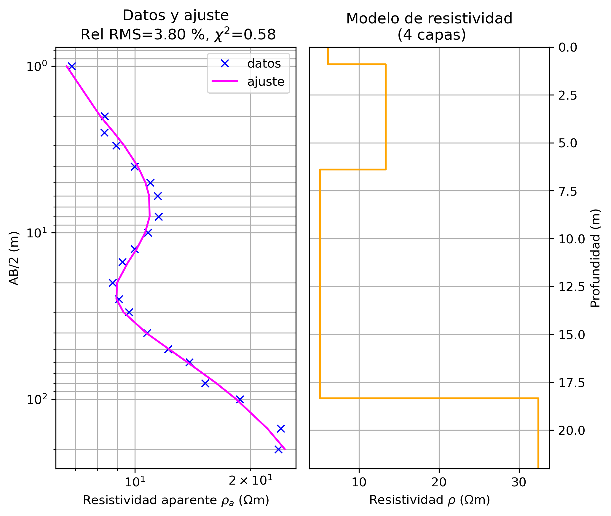

# GeoPy

Rutinas para el análisis e inversión de datos geofísicos usando pyGIMLi.

Para configurar PyGimli ver [Geofísica con PyGimli](./Geofisica_pyGIMLi.md).

Video tutoriales en [Procesamiento de datos geofísicos](https://youtube.com/playlist?list=PLwFZqgOB0j-9nsgZxya06TM8BDx7455Q4&si=iiRxJIz_Zjtvvqb7), tanto de estas rutinas como otros programas.

Ejemplos de resultados que se pueden obtener con estas rutinas:

*Tomografía eléctrica (ERT)* 

*Refracción sísmica (SRT)* 

*Sondeos eléctricos verticales (VES)* 